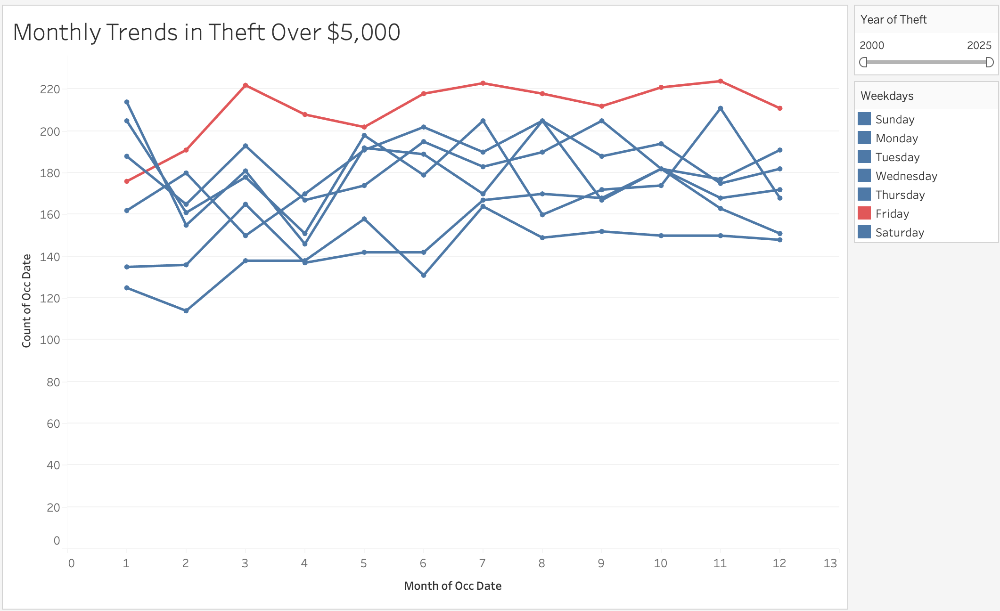

# Toronto Bike Theft Analysis

An interactive Tableau project analyzing bike theft incidents across Toronto to identify seasonal trends, high-risk periods, geographic patterns, and recurring theft activity.

## Project Objective

The objective of this project was to explore Toronto bike theft data and build an interactive Tableau dashboard that helps users understand when and where theft incidents occur most frequently.

## Tools Used

- Tableau
- Data Visualization
- Dashboard Design
- Geographic Analysis

## Analysis Performed

- Analyzed bike theft trends across different months
- Compared theft activity across days of the week
- Examined geographic patterns across Toronto
- Identified higher-theft periods and recurring seasonal trends
- Used interactive filters to compare different years and time periods
- Built visualizations to make theft patterns easier to interpret

## Dashboard

The Tableau dashboard was designed to make Toronto bike theft trends easy to explore and understand.

### Dashboard Features

- Monthly theft trend analysis
- Day-of-week comparisons
- Geographic theft analysis
- Year filtering
- Seasonal pattern identification
- Interactive visual exploration

## Key Takeaways

This project demonstrates my ability to analyze public safety data, identify patterns across time and location, and communicate findings through an interactive Tableau dashboard. It also strengthened my skills in geographic visualization, trend analysis, dashboard design, and data storytelling.
